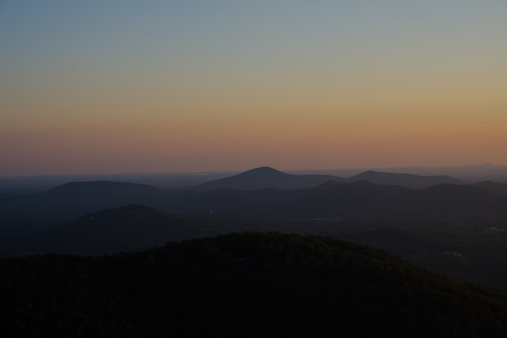

# About

A paragraph on a webpage vainly summarizes a person, nevertheless, here is a short description of me.

I am a computer science student at Georgia Tech, concentrating on devices and systems & architecture.
Eagerly awaiting placing fries in the bag, I spend my free time working on side projects, playing sports with friends, or exploring mountains and caves.

_Sunset over Yonah Mountain, September 2024_

## Contact

I don't have any social media; find me in real life.

For business purposes, reach out to <dgdurling@pm.me>.

---

This site was made using [Astro](https://astro.build).
See the source code on my [git server](https://git.dgd.sh/dan/dgd.dev).
