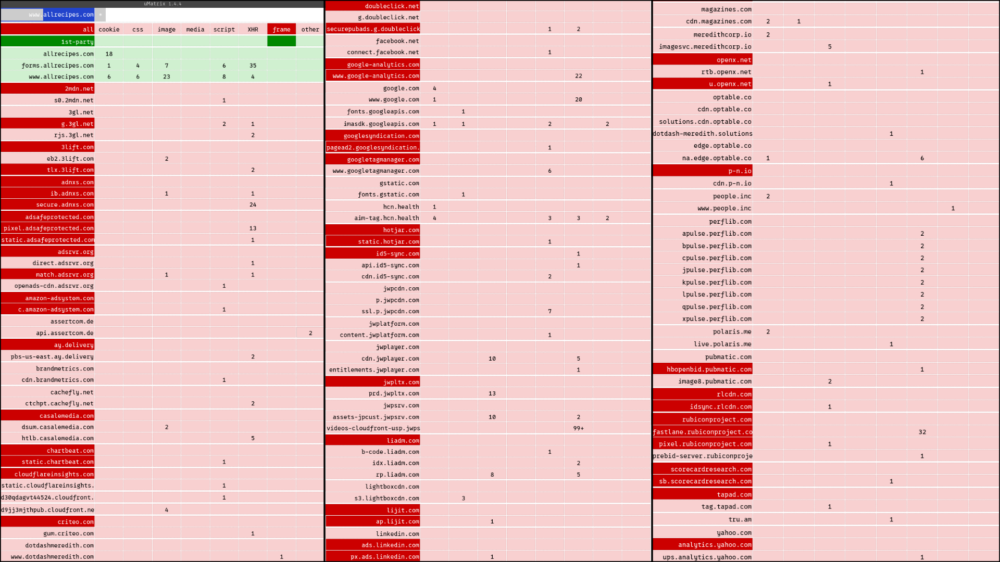

Every developer has their dogmas, so here I list some beliefs I have about how software should be designed, written, and maintained.

Expect this page to update and change over time.

## Free Software

Free software isn't software that doesn't cost money; it is "software that gives you the user freedom to share, study, and modify it." The Free Software Movement of the 80's and 90's served to liberate users and developers from digital tyranny by megacompanies distributing rigid, proprietary software. Virtually every tool, every company, and every computer on earth rely on some result of the movement. Free software undergirds how your computer and phone download files from the internet, play video and audio, and display websites, among countless other operations. In fact, Linux, possibly the most popular result of the Free Software Movement, [runs roughly 44% of all cloud compute in the world](https://www.mordorintelligence.com/industry-reports/server-operating-system-market).

This movement is the root of most creativity, freedom, and research regarding software and the internet. While the movement largely succeeded in its goals, the majority of software that people use today is proprietary code on top of these projects. Hackability and privacy are locked under binary blobs of code.

Developers today ought to honor the philosophy that gave them their ability to learn from and contribute to codebases. In almost every circumstance, I believe in writing free and open source software, even when it may make immediate profitability more difficult for a company.

For more information on free software, see the [Free Software Foundation's literature](https://www.fsf.org/about/what-is-free-software).

## Minimal Complexity

As a developer, one should **always** be seeking to minimize complexity.
Often, how complex a project will be is determined when the idea is conceived.
Choice of architecture and feature scope affect complexity the most, which may materializes long after the choices were made.

The Unix philosophy encompasses this idea well. One of the creators of the philosophy compiled the following [maxims](https://archive.org/details/bstj57-6-1899):

> - Make each program do one thing well. To do a new job, build afresh rather than complicate old programs by adding new features.
> - Expect the output of every program to become the input to another, as yet unknown, program. Don't clutter output with extraneous information. Avoid stringently columnar or binary input formats. Don't insist on interactive input.
> - Design and build software, even operating systems, to be tried early, ideally within weeks. Don't hesitate to throw away the clumsy parts and rebuild them.
> - Use tools in preference to unskilled help to lighten a programming task, even if you have to detour to build the tools and expect to throw some of them out after you've finished using them.

See a good summary of the Unix philosophy [here](http://www.catb.org/~esr/writings/taoup/html/ch01s06.html).

As outlined above, these projects defined the software world, so the ideas that built Unix should at least be considered.
However, organizations today seem desperate to pack as many hot new features in their software using the hot new framework that came out last week.
The NPM JavaScript ecosystem particularly causes feature packed websites at the cost of bloated development environments, [slower load times](https://bundlephobia.com), and a fresh vulnerability each week.

Consider a popular recipe website like [allrecipes.com](https://www.allrecipes.com/).
When a person clicks on a link to that website, they likely have one goal in mind: read a recipe, which includes some text and a few pictures.

Instead, the site bombards them with the following:

- Thick header with lots of white space
- Banner ads announcements
- Full screen ads
- Popup autoplaying videos

All of this bloat requires megabytes of data to be downloaded, not to mention the trackers, analytics, and actual photos and content of the recipe.
Using the ad blocker [uMatrix](https://github.com/gorhill/uMatrix) reveals just how much _junk_ allrecipes.com is fetching.

The cells in green are the content that is loaded by the actual site (allrecipes.com), while the cells in red are 3rd party requests that uMatrix blocks.
Ironically, the site still loads the header, recipe text and images, comments, and footer when all of the domains in red are blocked.
None of the junk is essential to the page loading, yet it still loads and eats your device's bandwidth and battery.
Therefore, a great majority of the code running on this website is antiproductive to the user.
It costs time, energy, and money to develop and arguably to run, but it only inhibits the user's goal of viewing a recipe.

Sites like these, which are most of the top sites on the internet, exemplify the opposite of minimalism.
Bandwith ought to be treated as a resource. JavaScript ought to be a last resort, when a **necessary** feature **cannot** be implemented with pure HTML and CSS.
There is more to say about the web, so see [Luke Smith's video on the topic](https://youtu.be/cvDyQUpaFf4).

In the case of web development, the project is often doomed to complexity before it begins due to the nature of the tooling available.
However, sometimes projects begin relatively simple, then _feature creep_ occurs.

To give an example of the consequences of incremental complexity, consider Microsoft Outlook.
The email service used to be a favorite among profesisonals using Windows.
Recently, it has fallen from grace due to a variety of software design choices that resulted in _New Outlook_.

- Native backend ditched in favor of Edge WebView2
- AI buttons littered about the UI
- Clean Windows 10 style UI updated to clunky [Fluent 2](https://fluent2.microsoft.design/) components

These changes resulted in a [slow](https://www.windowslatest.com/2026/06/15/microsofts-new-outlook-takes-10-seconds-to-do-what-outlook-classic-does-instantly-on-windows/) web app that [regresses in its capabilities](https://support.microsoft.com/en-us/outlook/getstarted/feature-comparison-between-new-outlook-and-classic-outlook) and forces AI and [Edge](https://support.microsoft.com/en-US/Outlook/web-links-from-outlook-emails-and-teams-chats-open-in-microsoft-edge) down the user's throat.
Despite its flaws, Classic Outlook was functional and had a clear UI. The complexity of switching backends, updating to an undercooked design system, and rapidly adding AI "features" destroyed Outlook.

Unfortunately, the idea of minimizing complexity is not taken seriously enough today. _Minimalism_ is either touted as a feature by developers trying to glaze their small project or sequestered to a subculture of the Linux development world.

Lines of code is not a metric to brag about, unless the number is small and the software is very useful. The [suckless](https://suckless.org) group exemplifies good software resulting from minimal complexity. Their [philosophy](https://suckless.org/philosophy/) is worth a read.
